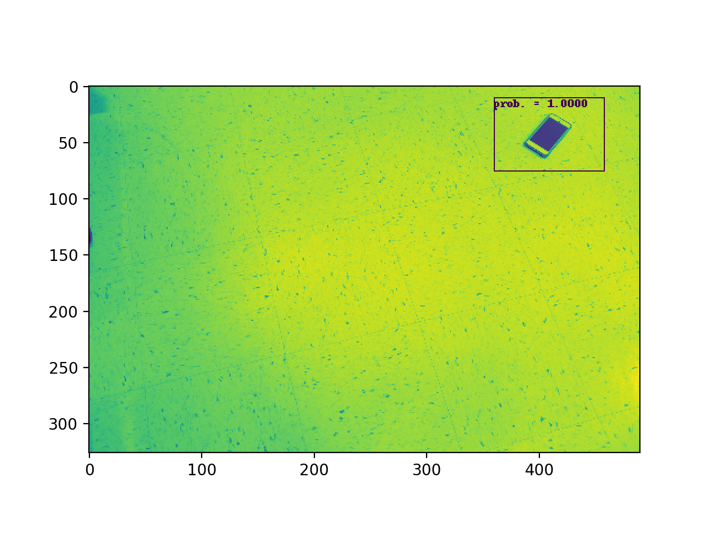

# Object-detection algorithm

Python 2.x code to compute the 
location of a phone on a floor from a single RGB camera image. 

## Usage 

Train the object-detection model using:
```
python train_phone_finder.py ./data 
```
Test the model using: 
```
python find_phone.py ./data/x.jpg
```
which will print to the terminal 
the normalized coordinates of the phone in the test image and 
show the image with a box around the detected phone:



